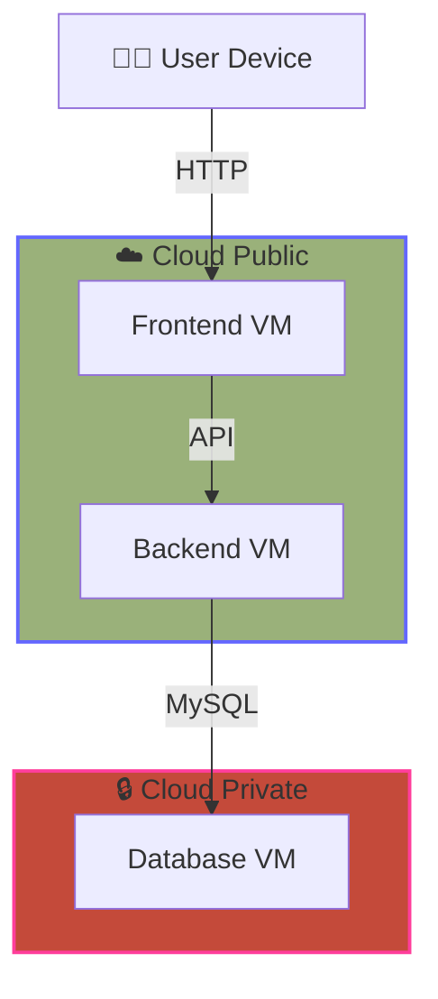

# Bài tập lớn ☁️🔗🏠

## 🎯 Mục tiêu đề tài

Triển khai một nền tảng `Drug Use Prevention Support System` sử dụng kiến trúc Hybrid Cloud, kết hợp `Cloud Private` và `Cloud Public`. Cấu hình các lớp bảo mật, tường lửa, VPN để đảm bảo an toàn thông tin.
- `Cloud Private` là nơi chứa Database triển khai bằng Docker trên máy ảo VMware.
- `Cloud Public` là nơi chứa Server(Frontend & Backend) triển khai bằng Docker trên máy ảo Microsoft Azure.



## 🏠 VMware (Cloud Private)

<a name="install-docker"></a>
### Bước 1: Cài đặt Docker 🐳
Trước tiên, hãy đảm bảo hệ điều hành được cập nhật và cài đặt môi trường ảo hóa Docker để chạy database một cách gọn nhẹ.

1. Cài đặt Docker:
   ```bash
   sudo apt install docker.io docker-compose-v2 -y
   ```
2. Bật Docker khởi động cùng hệ thống:
   ```bash
   sudo systemctl enable --now docker
   ```
3. Kiểm tra xem Docker đã chạy thành công chưa:
   ```bash
   sudo docker --version
   ```
4. Cấp quyền tài khoản hiện tại vào nhóm docker:
   ```bash
   sudo usermod -aG docker $USER
   ```
5. Nạp lại quyền hệ thống ngay lập tức (không cần khởi động lại máy)
   ```bash
   newgrp docker
   ```

### Bước 2: Khởi chạy Database MySQL bằng Docker 🛢
Thay vì phải cài đặt MySQL trực tiếp lên Ubuntu rất rườm rà, bạn chỉ cần chạy một câu lệnh duy nhất để Docker tải và khởi chạy MySQL.

> Lưu ý: vì muốn thiết lập tường lửa hạn chế đụng vào Database

Chạy lệnh sau (bạn có thể thay đổi `1` thành mật khẩu thực tế bạn):

```bash
sudo docker run -d \
  --name mysql-db \
  -e MYSQL_ROOT_PASSWORD=1 \
  -e MYSQL_DATABASE=doanyte \
  -p 10.8.0.2:3306:3306 \
  mysql:8.0
```

**Giải thích thông số:**
* `--name mysql-db`: Đặt tên cho container để dễ quản lý.
* `-e MYSQL_DATABASE=doanyte`: Tự động tạo sẵn một database trống có tên `doanyte` cho project của bạn.
* `-p 10.8.0.2:3306:3306`: Ánh xạ cổng 3306 của container ra cổng 3306 của máy ảo Ubuntu và chỉ cho phép dải IP của VPN truy cập vào.

Hoặc dùng [docker-compose-mysql.yml](docker-compose-mysql.yml) để khởi chạy (khuyên dùng):

```bash
sudo docker compose -f docker-compose-mysql.yml up -d
```

Kiểm tra xem container MySQL đã chạy ở trạng thái "Up" chưa bằng lệnh:

```bash
sudo docker ps
```

### Bước 3: Đưa dữ liệu (.sql) vào Database
Bây giờ database đã chạy, bạn cần import các bảng dữ liệu (User, Product, Order...) từ file `.sql` của project Java cũ vào.

1. Đưa file `.sql` của bạn vào máy ảo Ubuntu (bạn có thể dùng WinSCP, FileZilla, hoặc tải trực tiếp bằng `wget` nếu bạn đã up file lên Git/Drive). Giả sử file của bạn tên là `database.sql`.
2. Dùng lệnh sau để đẩy dữ liệu từ file `.sql` vào bên trong container MySQL đang chạy:
   ```bash
   sudo docker exec -i mysql-db mysql -uroot -pmat_khau_root doanyte < database.sql
   ```
*(Lưu ý: Viết liền `-p` và mật khẩu, không có khoảng trắng ở giữa).*

### Bước 4: Mở cổng tường lửa (Firewall) trên máy ảo 🔥🧱🛡️
Bật tường lửa UFW của Linux. Chỉ cho phép duy nhất dải mạng nội bộ của VPN (`10.8.0.x`) được phép chạm vào cổng 3306 (MySQL). 

1. Khởi tạo luật mặc định (Đóng cửa từ bên ngoài, mở cửa từ bên trong):
   ```bash
   sudo ufw default deny incoming
   sudo ufw default allow outgoing
   ```
2. Cho phép kết nối SSH (để tránh việc bạn tự khóa mình ra khỏi máy nếu đang dùng SSH từ máy Host vào):
   ```bash
   sudo ufw allow to any port 22
   ```
3. Cho phép kết nối vào cổng 3306 của MySQL chỉ từ dải IP của VPN:
   ```bash
   sudo ufw allow from 10.8.0.0/24 to any port 3306
   ```
4. Kích hoạt tường lửa (nếu nó chưa bật):
   ```bash
   sudo ufw enable
   ```
   *(Nhấn `y` và `Enter` nếu hệ thống hỏi xác nhận).*
5. Kiểm tra lại trạng thái tường lửa:
   ```bash
   sudo ufw status numbered
   ```
   Kết quả trả về:
   ```powershell
   Status: active
      To                         Action      From
      --                         ------      ----
   [ 1] 3306                       ALLOW IN    10.8.0.0/24
   [ 2] 22                         ALLOW IN    Anywhere
   [ 3] Samba                      ALLOW IN    Anywhere
   [ 4] 22 (v6)                    ALLOW IN    Anywhere (v6)
   [ 5] Samba (v6)                 ALLOW IN    Anywhere (v6)
   ```

### Bước 5: Kiểm tra kết nối Database tại chỗ 🔍
Để chắc chắn mọi thứ đã hoàn hảo, bạn có thể kiểm tra xem cổng 3306 đã thực sự lắng nghe chưa:
```bash
sudo ss -tulpn | grep 3306
```
```text
tcp   LISTEN 0      4096                                      10.8.0.2:3306       0.0.0.0:*    users:(("docker-proxy",pid=6176,fd=8))
```

---

## ☁️ Microsoft Azure (Cloud Public)
Bây giờ, hãy di chuyển lên **Public Cloud (Microsoft Azure)** để xây dựng "mặt tiền" cho nền tảng bán xe đạp của bạn. Mục tiêu của bước này là tạo một máy chủ ảo (VM) tối ưu chi phí (để bảo toàn 100$ credit) và mở đúng các "cửa" (Port) cần thiết. Bạn hãy làm theo các bước sau trên trình duyệt:

### Bước 1: Khởi tạo Máy ảo (Virtual Machine) trên Azure 🖥️
1. Truy cập vào [portal.azure.com](https://portal.azure.com/) và đăng nhập bằng tài khoản của bạn.
2. Tại thanh tìm kiếm trên cùng, gõ **Virtual Machines** và chọn nó.
3. Nhấp vào nút **Create** ➔ Chọn **Virtual machine**.

### Bước 2: Cấu hình Thông số cơ bản (Tab Basics) ⚙️
Tại tab này, bạn cần cấu hình cẩn thận để tránh bị trừ tiền oan:
* **Resource group:** Nhấp vào *Create new* và đặt một cái tên dễ nhớ (ví dụ: `CloudComputing`).
* **Virtual machine name:** Đặt tên cho máy chủ (ví dụ: `Azure`).
* **Region:** Chọn khu vực gần Việt Nam nhất để tốc độ mạng nhanh (ví dụ: `Central India`).
* **Availability options:** Chọn `No infrastructure redundancy required`.
* **Security type:** Chọn `Standard`.
* **Image:** Chọn `Ubuntu Server 24.04 LTS` (hoặc `22.04 LTS`).
* **Size:** Bấm vào `See all sizes`, tìm và chọn `Standard_B2ats_v2` (`Standard_B1s` hoặc `Standard_B2s` nếu B1s hết chỗ). Dòng B-series này cực kỳ rẻ, hoàn hảo cho ngân sách `100$` của sinh viên.
> Lưu ý: Sweden không thể dùng cho **Sinh Viên**
* **Administrator account:** * Chọn `Password` (cho dễ quản lý trong quá trình làm đồ án). 
    * Nhập Username (ví dụ: `glass`) và Mật khẩu đủ mạnh. *Lưu ý: Nhớ kỹ thông tin này để lát nữa chúng ta đăng nhập.*

### Bước 3: Cấu hình Mạng & Tường lửa (Tab Networking) 🌐
Đây là bước **QUAN TRỌNG NHẤT** để hệ thống Hybrid Cloud hoạt động được.
1. Chuyển sang tab **Networking** (phía trên cùng).
2. Ở mục *NIC network security group*, hãy chọn **Advanced**.
3. Ngay bên dưới chỗ *Configure network security group*, nhấp vào **Create new**.
4. Một bảng cấu hình hiện ra. Theo mặc định, Azure đã mở sẵn cổng 22 (SSH). Bạn cần nhấp vào **Add an inbound rule** để mở thêm 3 cửa nữa:
    * **Cửa cho Web (React):** Mở Port `80` (Giao thức TCP).
    * **Cửa cho VPN (OpenVPN):** Mở Port `1194` (Giao thức UDP).
5. Nhấn OK để lưu các rule tường lửa này.

### Bước 4: Hoàn tất và Lấy IP Public ɪᴘ
1. Bấm nút **Review + create** ở dưới cùng.
2. Đợi Azure kiểm tra hợp lệ, sau đó bấm **Create**.
3. Quá trình tạo máy ảo sẽ mất khoảng 1-2 phút. Khi có thông báo *Your deployment is complete*, hãy nhấp vào nút **Go to resource**.
4. Tại trang thông tin của máy ảo, hãy nhìn sang góc bên phải, bạn sẽ thấy mục **Public IP address**. Hãy copy và lưu lại dãy số này (Ví dụ: `20.235.122.97`). Đây chính là địa chỉ "mặt tiền" của hệ thống trên Internet.

### Bước 5: Kết nối vào máy chủ Azure 🔗
Bây giờ, hãy mở **Terminal** (nếu dùng Mac/Linux) hoặc **PowerShell / Command Prompt** (nếu dùng Windows) trên máy tính thật của bạn và gõ lệnh sau:

```bash
ssh glass@20.235.122.97
```
*(Thay `glass` bằng username bạn đã tạo ở Bước 2 và `20.235.122.97` bằng IP Public của bạn).* Nhập `yes` nếu được hỏi, sau đó nhập mật khẩu.

Khi bạn thấy dòng chữ `glass@Azure:~$` hiện ra, xin chúc mừng, bạn đã kiểm soát thành công đám mây công cộng của Microsoft!

### Bước 6: Cài đặt Docker

Hãy đọc lại trên đã hướng cho VMware [Docker](#install-docker).

### Bước 7: Mở cổng tường lửa (Firewall) trên máy ảo 🔥🧱🛡️
Bật tường lửa UFW của Linux. 

1. Khởi tạo luật mặc định (Đóng cửa từ bên ngoài, mở cửa từ bên trong):
   ```bash
   sudo ufw default deny incoming
   sudo ufw default allow outgoing
   ```
2. Cho phép kết nối SSH (để tránh việc bạn tự khóa mình ra khỏi máy nếu đang dùng SSH từ máy Host vào):
   ```bash
   sudo ufw allow to any port 22
   ```
3. Cho phép kết port 3000 để vào Grafana:
   ```bash
   sudo ufw allow to any port 3000
   ```
4. Kích hoạt tường lửa (nếu nó chưa bật):
   ```bash
   sudo ufw enable
   ```
   *(Nhấn `y` và `Enter` nếu hệ thống hỏi xác nhận).*
5. Kiểm tra lại trạng thái tường lửa:
   ```bash
   sudo ufw status numbered
   ```
   Kết quả trả về:
   ```powershell
   Status: active
      To                         Action      From
      --                         ------      ----
   [ 1] 22                         ALLOW IN    Anywhere
   [ 2] 3000                       ALLOW IN    Anywhere
   [ 3] 22 (v6)                    ALLOW IN    Anywhere (v6)
   [ 4] 3000 (v6)                  ALLOW IN    Anywhere (v6)
   ```

## Tạo Đường hầm VPN bảo mật từ Azure về máy ảo VMware ở nhà
Chúng ta sẽ bắt tay vào việc quan trọng nhất: **Đúc một "đường ống" bảo mật nối thẳng từ Azure về máy ảo VMware ở nhà bạn.** Để tiết kiệm hàng giờ đồng hồ ngồi cấu hình chứng chỉ bảo mật thủ công, mình sẽ đưa bạn một đoạn script (thần chú) tự động hóa 100% quá trình cài đặt OpenVPN Server.

### ☁️ Microsoft Azure (Cloud Public)

#### Bước 1: Tải và chạy Script cài đặt OpenVPN 📥
Đầu tiên, tải kịch bản tự động từ kho lưu trữ mã nguồn mở uy tín (Angristan) và cấp quyền thực thi cho nó:
```bash
curl -O https://raw.githubusercontent.com/angristan/openvpn-install/master/openvpn-install.sh
chmod +x openvpn-install.sh
```
Sau đó, khởi chạy bằng quyền quản trị:
```bash
sudo ./openvpn-install.sh interactive
# hoặc
sudo ./openvpn-install.sh install
```

#### Bước 2: Trả lời các thiết lập (Cực kỳ quan trọng) 🚨
Ngay khi chạy lệnh trên, màn hình sẽ hiện ra một loạt các câu hỏi để thiết lập mạng. Hầu hết bạn chỉ cần nhấn `Enter` để chọn mặc định, nhưng **phải đặc biệt chú ý 2 chỗ sau**:

```bash
=== OpenVPN Installer ===

The git repository is available at: https://github.com/angristan/openvpn-install
I need to ask you a few questions before starting the setup.
You can leave the default options and just press enter if you are okay with them.

Detecting server IP addresses...
  IPv4 address detected: 10.0.0.4
  No IPv6 address detected

What IP version should clients use to connect to this server?
   1) IPv4
   2) IPv6
Endpoint type [1-2]: 1

Server listening IPv4 address:
IPv4 address: 20.235.122.97

What IP versions should VPN clients use?
This determines both their VPN addresses and internet access through the tunnel.
   1) IPv4 only
   2) IPv6 only
   3) Dual-stack (IPv4 + IPv6)
Client IP versions [1-3]: 1

IPv4 VPN subnet:
   1) Default: 10.8.0.0/24
   2) Custom
IPv4 subnet choice [1-2]: 1

What port do you want OpenVPN to listen to?
   1) Default: 1194
   2) Custom
   3) Random [49152-65535]
Port choice [1-3]: 1

What protocol do you want OpenVPN to use?
UDP is faster. Unless it is not available, you shouldn't use TCP.
   1) UDP
   2) TCP
Protocol [1-2]: 1

What DNS resolvers do you want to use with the VPN?
   1) Current system resolvers (from /etc/resolv.conf)
   2) Self-hosted DNS Resolver (Unbound)
   3) Cloudflare (Anycast: worldwide)
   4) Quad9 (Anycast: worldwide)
   5) Quad9 uncensored (Anycast: worldwide)
   6) FDN (France)
   7) DNS.WATCH (Germany)
   8) OpenDNS (Anycast: worldwide)
   9) Google (Anycast: worldwide)
   10) Yandex Basic (Russia)
   11) AdGuard DNS (Anycast: worldwide)
   12) NextDNS (Anycast: worldwide)
   13) Custom
DNS [1-13]: 3

Do you want to allow a single .ovpn profile to be used on multiple devices simultaneously?
Note: Enabling this disables persistent IP addresses for clients.
Allow multiple devices per client? [y/n]: n

Do you want to customize the tunnel MTU?
   MTU controls the maximum packet size. Lower values can help
   with connectivity issues on some networks (e.g., PPPoE, mobile).
   1) Default (1500) - works for most networks
   2) Custom
MTU choice [1-2]: 1

Choose the authentication mode:
   1) PKI (Certificate Authority) - Traditional CA-based authentication (recommended for larger setups)
   2) Peer Fingerprint - Simplified WireGuard-like authentication using certificate fingerprints
      Note: Fingerprint mode requires OpenVPN 2.6+ and is ideal for small/home setups
Authentication mode [1-2]: 1

Do you want to customize encryption settings?
Unless you know what you're doing, you should stick with the default parameters provided by the script.
Note that whatever you choose, all the choices presented in the script are safe (unlike OpenVPN's defaults).
See https://github.com/angristan/openvpn-install#security-and-encryption to learn more.

Customize encryption settings? [y/n]: n

Okay, that was all I needed. We are ready to setup your OpenVPN server now.
You will be able to generate a client at the end of the installation.
Press any key to continue...
```

#### Bước 3: Tạo "Chìa khóa" cho máy ảo ở nhà (Client OVPN) 🗝️
Sau khi cài đặt xong phần lõi, script sẽ yêu cầu bạn tạo ngay một người dùng (Client) đầu tiên để kết nối vào. Đây chính là "tấm vé thông hành" cho máy ảo VMware của bạn.
1. **Client name:** Gõ một cái tên dễ nhớ, ví dụ: `VMware`
2. **Select an option (Password):** Chọn **`1` (Add a passwordless client)**. *Lý do: Chọn không mật khẩu để sau này máy ảo ở nhà bạn cứ bật lên là tự động cắm VPN vào luôn, không cần có người ngồi gõ mật khẩu.*

Script sẽ chạy rẹt rẹt tạo mã khóa, và cuối cùng hiện ra thông báo: `Client VMware added, configuration is available at: /home/azureuser/VMware.ovpn`

### 🏠 VMware (Cloud Private)
Hãy mở cửa sổ Terminal của máy ảo VMware ở nhà và làm theo 3 bước sau:

#### Bước 1: Cài đặt gói phần mềm OpenVPN Client 📥
Trên máy ảo local, bạn chỉ cần cài gói phần mềm cơ bản của hệ điều hành, không cần chạy script dài dòng kia nữa:
```bash
sudo apt update
sudo apt install openvpn -y
```

#### Bước 2: Mang "Chìa khóa" từ Ấn Độ về nhà 🗝️
File cấu hình `VMware.ovpn` đang nằm trên máy chủ Azure. Bạn cần mang nó về máy VMware. Cách chuyên nghiệp và nhanh nhất là dùng lệnh `scp` (Secure Copy) để tải file xuyên quốc gia.

Vẫn đứng tại cửa sổ Terminal của **máy ảo VMware**, bạn gõ lệnh sau:
```bash
scp glass@20.235.122.97:~/VMware.ovpn ~/
```
> Lưu ý: Khi chạy lệnh này, nếu nó hỏi Are you sure you want to continue connecting (yes/no)?, bạn hãy gõ chữ yes rồi nhấn Enter. Sau đó nhập mật khẩu máy ảo Azure của bạn vào. Đôi khi bị dín ký tự ẩn nên yes không thành công! Có thể dùng dưới đây:
> ```bash
> scp -o StrictHostKeyChecking=no glass@20.235.122.97:~/VMware.ovpn ~/
> ```

#### Bước 3: Cắm chìa khóa và kích hoạt Đường hầm Hybrid 🔐
Bây giờ file `VMware.ovpn` đã nằm gọn trong máy ảo ở nhà bạn. Hãy kích hoạt kết nối bằng quyền quản trị:
```bash
sudo openvpn --config ~/VMware.ovpn
```

##### **_Có thể gặp lỗi và cách xử lý:_** 🛠️
Thấy kết nối đang bị "treo" ở dòng cuối cùng `UDPv4 link remote: [AF_INET]20.235.122.97:1194`. Nó không chịu chạy tiếp ra chữ `Initialization Sequence Completed`. Đây là một tình huống gỡ lỗi (debug) mạng rất kinh điển. Có 2 nguyên nhân đang xảy ra cùng lúc, và chúng ta sẽ xử lý gọn gàng cả hai:

_1. Lỗi file cấu hình có chứa lệnh của Windows_

**Hệ thống báo lỗi:** `Unrecognized option... block-outside-dns`. Đây là một tùy chọn chống rò rỉ DNS chỉ dành riêng cho hệ điều hành Windows. Khi chạy trên Linux (Ubuntu), nó không hiểu lệnh này nên báo lỗi. 

**Cách xử lý:** Bạn mở file cấu hình ra để chỉnh sửa `~/VMware.ovpn` thêm dấu thăng `#` vào đầu dòng để vô hiệu hóa nó (thành `#setenv opt block-outside-dns`). Hoặc dùng
```cmd
sed -i 's/setenv opt block-outside-dns/#setenv opt block-outside-dns/g' ~/VMware.ovpn
```

_2. Tường lửa Azure đang chặn cửa (Nguyên nhân chính gây treo)_

**Hệ thống báo lỗi:** Lý do đứng im ở dòng `UDPv4 link remote...` là vì máy VMware ở nhà đang cố hét lên "Mở cửa cho tôi!" qua cổng 1194 ?> UDP, nhưng trạm gác bên Azure không phản hồi. Do ban nãy bạn đổi vùng máy ảo, tường lửa (Network Security Group) đã bị thiết lập lại từ đầu, và **nên đã quên tất cả các quy tắc tường lửa**

**Cách xử lý:**
1. Trở lại giao diện Web của **Azure Portal**.
2. Vào máy ảo ở Ấn Độ của bạn ➔ Chọn tab **Networking**.
3. Bấm **Add inbound port rule** (như bạn đã làm rất chuẩn ở bước trước).
4. **Service:** Custom.
5. **Destination port ranges:** `1194`.
6. **Protocol:** Bắt buộc phải chọn **UDP** (nếu chọn TCP mạng sẽ tiếp tục bị treo).
7. Bấm **Add** và đợi vài giây để Azure cập nhật tường lửa.

> Sau khi sửa xong file và mở cổng UDP trên Azure, bạn quay lại máy ảo VMware và bấm phím `Ctrl + C` để ngắt cái lệnh đang bị treo lúc nãy đi. Sau đó, chạy lại lệnh kích hoạt một lần nữa! Hãy kiểm tra xem có dòng `Initialization Sequence Completed` thì thành công!

#### Bước 4: Kiểm tra IP của Két sắt dữ liệu 👀
Bạn hãy mở một **cửa sổ Terminal mới** trên máy ảo VMware (local) và gõ lệnh sau:
```bash
ip a
```
Hãy nhìn vào kết quả trả về, bạn sẽ thấy một card mạng hoàn toàn mới xuất hiện mang tên là **`tun0`** (Tunnel). Nó thường sẽ được cấp địa chỉ IP là **`10.8.0.2`**. Thường thì máy Azure sẽ mang IP `10.8.0.1`, còn máy VMware của bạn sẽ mang IP `10.8.0.2`.

#### Bước 5: Test thông mạng xuyên quốc gia 🧪
Vẫn ở cửa sổ Terminal mới đó trên máy VMware, bạn thử "gọi" lên máy chủ Azure (thường mang IP `10.8.0.1`) qua đường hầm ảo này xem sao:
```bash
ping 10.8.0.1 -c 4
```
Nếu bạn thấy các gói tin phản hồi lại (Reply) với thời gian trễ (time) báo về, hệ thống của bạn đã hoàn hảo 100%!

---

## Cấu hình một số file trong dự án 🛠️

> Bạn không cần phải cấu hình lại nữa vì tôi đã cấu hình sẵn cho bạn rồi. Dưới đây chỉ là liệt kê nhưng file đã được cấu hình sẵn:

### Cấu hình Java Backend để qua đường hầm VPN
Đây là lúc chúng ta ghép nối code dự án vào hạ tầng. Ở máy tính dùng để code (nơi chứa source code Java của bạn), hãy mở file cấu hình database (thường là `application.properties` hoặc `application.yml` trong Spring Boot).

Bạn hãy sửa đổi chuỗi kết nối (URL) trỏ thẳng vào cái IP ảo của đường hầm, thay vì `localhost` hay IP Public:

```properties
# Sửa lại URL trỏ vào IP của máy ảo VMware qua đường hầm VPN
spring.datasource.url=jdbc:mysql://10.8.0.2:3306/doanyte?createDatabaseIfNotExist=true&useUnicode=true&characterEncoding=utf-8&useSSL=false&allowPublicKeyRetrieval=true
spring.datasource.username=root
spring.datasource.password=1
```

### Cấu hình môi trường Frontend (React)
Backend Java của bạn bị chặn cổng 8080 ở Azure, thì làm sao Frontend React gọi API được? Đây chính là lúc bạn trình diễn kỹ năng triển khai Reverse Proxy (Proxy ngược). Người dùng và Hacker ngoài Internet hoàn toàn không biết Backend của bạn chạy bằng Java hay cổng nào. Họ chỉ thấy Nginx. Nginx đứng ra làm "Lễ tân" hứng chịu mọi đợt tấn công DDoS thay cho Backend.

#### Bước 1: Thay đổi địa chỉ API trong code Frontend (React)
Trước đây, code React của bạn đang gọi thẳng vào `http://20.235.122.97:8080`. Giờ cổng này đã chặn, bạn phải bảo React gọi vào cổng 80 mặc định (tức là chỉ cần IP, không cần đuôi cổng).

1. Mở code Frontend trên máy tính của bạn.
2. Tìm đến file chứa cấu hình gọi API (thường là file `.env`).
3. Đổi địa chỉ Base URL:
   * **Cũ:** `http://20.235.122.97:8080`
   * **Mới:** `http://20.235.122.97` *(Bỏ hẳn đuôi :8080 đi)*
4. Lưu lại, **Build lại Frontend** (`npm run build`) và đẩy thư mục `build` mới này lên Azure đè lên thư mục cũ.

#### Bước 2: Cấu hình "Người Lễ Tân" Nginx (Trên máy Azure)
Bạn mở cửa sổ SSH vào máy Azure, chúng ta sẽ can thiệp vào não bộ của Nginx. Dựa vào folder `controller` trong Backedn có các đầu API là `/auth`, `/courses`, `/files`, `/swagger-ui`, ... Ta sẽ dạy Nginx tự động nhận diện các đầu API này.

**1. Mở file cấu hình Nginx:**
```bash
sudo nano Frontend/nginx.conf
```

**2. Chỉnh sửa nội dung:**
Bạn tìm đoạn `server { ... }` hiện tại, xóa nội dung bên trong và thay thế bằng cấu trúc chuẩn Enterprise dưới đây (hãy chú ý đường dẫn thư mục `root` của React, bạn nhớ trỏ cho đúng thư mục web của bạn nhé):

```nginx
server {
    listen 80;
    server_name _;
    root /usr/share/nginx/html;
    index index.html;

    include /etc/nginx/mime.types;

    # [BẮT BUỘC] Cho phép upload file nặng lên tới 50MB
    client_max_body_size 50M;

    # [CẬP NHẬT] Chỉ để những API thật sự tồn tại trong code của bạn.
    location ~ ^/(appointments|auth|courses|programs|survey|users|statistics|files|swagger-ui)(/|$) {
        proxy_pass http://backend:8080;

        proxy_set_header Host $host;
        proxy_set_header X-Real-IP $remote_addr;
        proxy_set_header X-Forwarded-For $proxy_add_x_forwarded_for;
        proxy_set_header X-Forwarded-Proto $scheme;

        proxy_set_header Authorization $http_authorization;
    }

    # Xử lý CSS/JS
    location ~* \.(js|css|png|jpg|jpeg|gif|ico|svg|woff|woff2|ttf|eot)$ {
        try_files $uri =404;
        expires 1y;
        add_header Cache-Control "public, immutable";
    }

    # Xử lý React Router
    location / {
        try_files $uri $uri/ /index.html;
    }
}
```

### Cấu hình file Dockerfile trong Frontend
Sửa file `FrontEnd/Dockerfile` của bạn lại chỉ còn đúng 6 dòng này:
```dockerfile
# Dockerfile siêu nhẹ cho Frontend
FROM nginx:alpine

# Xóa file cấu hình Nginx mặc định của Docker
RUN rm /etc/nginx/conf.d/default.conf

# Copy file nginx.conf của bạn vào
COPY nginx.conf /etc/nginx/conf.d/

# Copy thư mục build đã làm sẵn ở nhà vào thư mục web của Nginx
COPY build /usr/share/nginx/html

EXPOSE 80
CMD ["nginx", "-g", "daemon off;"]
```

### Cấu hình file Dockerfile trong Backend
Sửa file `BackEnd/Dockerfile` của bạn lại chỉ còn đúng 6 dòng này:
```dockerfile
# Dockerfile siêu nhẹ cho Backend
FROM eclipse-temurin:17-jdk
WORKDIR /app
COPY target/*.jar app.jar
EXPOSE 8080
CMD ["java", "-jar", "app.jar"]
```

---

## Đưa dự án lên Azure và chạy Docker (Cách nào cũng được, nhưng Cách 2 sẽ nhẹ nhàng hơn rất nhiều)

### Cách 1: Chạy trực tiếp trên Azure VM (Không khuyến khích)
Con máy chủ dòng size nhỏ thường chỉ có **1GB RAM**. Trong khi đó, cái lệnh `npm install` của React (FrontEnd) nổi tiếng là một con "quái vật ngốn RAM". Khi Docker chạy lệnh này, nó vắt kiệt 1GB RAM của máy ảo, khiến hệ thống bị treo cứng (đứng hình) và không thể chạy tiếp được nữa. Để cứu vớt tình huống này mà không cần tốn tiền nâng cấp máy chủ, chúng ta sẽ dùng một "ma thuật" của dân quản trị hệ thống Linux: **Tạo RAM ảo (Swap File)**. Chúng ta sẽ lấy 2GB ổ cứng để làm RAM tạm thời, giúp thằng Docker có chỗ để thở và build xong dự án. Bạn hãy làm theo các bước "cấp cứu" sau nhé:

#### Bước 1: Hủy lệnh đang bị treo
Ngay tại cửa sổ Terminal đang chạy chữ đó, bạn bấm tổ hợp phím **`Ctrl + C`** để ép nó dừng lại. (Nếu nó đơ quá không nhận lệnh, bạn cứ tắt hẳn cửa sổ Terminal đi rồi SSH vào lại máy Azure nhé).

#### Bước 2: Bơm 16GB RAM ảo (Swap) cho máy chủ
Tại dấu nhắc lệnh của máy Azure, bạn copy và chạy dồn 4 dòng lệnh này:

```bash
# 1. Cắt 16GB ổ cứng để làm file RAM ảo
sudo fallocate -l 16G /swapfile

# 2. Phân quyền bảo mật cho file
sudo chmod 600 /swapfile

# 3. Định dạng file đó thành Swap
sudo mkswap /swapfile

# 4. Kích hoạt RAM ảo lên hệ thống!
sudo swapon /swapfile
```

*Để kiểm tra xem RAM ảo đã nhận chưa, bạn gõ lệnh `free -h`. Nếu thấy dòng `Swap` hiện lên 16.0G là thành công rực rỡ!*

#### Bước 3: Build lại dự án
Bây giờ hệ thống đã có tổng cộng 17GB RAM (1GB thật + 16GB ảo), dư sức "cân" thằng React. Bạn chạy lại lệnh khởi động Docker nhé:

```bash
docker compose up -d --build
```

**Lưu ý:** Vì Swap dùng ổ cứng thay cho RAM nên tốc độ build của `npm install` sẽ hơi chậm một chút (có thể mất khoảng 5-10 phút). Nhưng điểm khác biệt là nó **sẽ tiếp tục chạy cho đến khi xong** chứ không bị treo vĩnh viễn như lúc nãy nữa.

Bạn hãy cấp cứu bằng RAM ảo rồi chạy lại lệnh xem. Lần này nếu thấy nó báo chữ `Started` màu xanh lá cho cả 2 container là chúng ta chính thức tốt nghiệp đồ án! Có kết quả bạn nhớ báo mình nhé.

### Cách 2: Chạy trên máy tính cá nhân (Khuyến khích)
Đây là cách các kỹ sư thực tế triển khai dự án lên máy chủ cấu hình yếu. Chúng ta sẽ không bắt con máy 1GB RAM phải biên dịch code cực nhọc nữa.

#### Bước 1: Build tại máy tính của bạn
##### **_A. Build với môi trường có sẵn_**
**FrontEnd**
Mở Terminal/PowerShell trên máy tính cá nhân (nơi bạn đang chứa source code), di chuyển vào thư mục `FrontEnd` và chạy lệnh sau để build ra bản Production (Thay IP bằng IP Azure của bạn nếu cần):

*Windows PowerShell:*
```powershell
$env:REACT_APP_API_URL="http://20.235.122.97"; npm install; npm run build
```
*Mac/Linux/Git Bash:*
```bash
REACT_APP_API_URL=http://20.235.122.97 npm install && npm run build
```
Lệnh này sẽ tạo ra một thư mục tên là `build` (hoặc `dist`). Đây là toàn bộ Frontend đã được nén lại siêu nhẹ.

> Lưu ý: Chỉnh lại ip cho tất cả các file cấu hình của Java Backend và React Frontend để trỏ vào đúng IP của máy ảo Azure.

**BackEnd**
Build tương tự như FrontEnd nhưng không cần chỉnh IP vì nó đã được cấu hình sẵn trong file `application.properties`.

```bash
cd BackEnd
mvn clean package -DskipTests
```

Lệnh này sẽ tạo ra một file `.jar` trong thư mục `target`. Đây là toàn bộ Backend đã được nén lại siêu nhẹ.

##### **_B. Build với Docker(Khuyến khích)_**
**FrontEnd**
*Ubuntu Server, Mac hoặc Windows PowerShell:*
```bash
docker run --rm -v "${PWD}:/app" -v /app/node_modules -w /app node:20-alpine sh -c "npm install && npm run build"
```

*Windows Command Prompt (CMD)*
```bash
docker run --rm -v "%cd%":/app -v /app/node_modules -w /app node:20-alpine sh -c "npm install && npm run build"
```

**BackEnd**

*Ubuntu Server, Mac hoặc Windows PowerShell:*
```bash
docker run --rm -v "${PWD}:/app" -w /app maven:3.9.9-eclipse-temurin-17 mvn clean package -DskipTests
```

*Windows Command Prompt (CMD)*
```bash
docker run --rm -v "%cd%":/app -w /app maven:3.9.9-eclipse-temurin-17 mvn clean package -DskipTests
```

#### Bước 2: Đẩy lên và chạy trong 10 giây
Bây giờ, bạn chỉ cần dùng lệnh `scp` đẩy lại thư mục `FrontEnd` lên Azure và chạy lệnh `docker compose up -d --build`. Nó sẽ tốn chưa tới 1 phút và chỉ tốn khoảng 20MB RAM để chạy cái giao diện của bạn!

**Terminal(Ubuntu/Ubuntu Server)**
```bash
rsync -avzR -e "ssh -o StrictHostKeyChecking=no" \
  ./FrontEnd/build \
  ./FrontEnd/nginx.conf \
  ./FrontEnd/Dockerfile \
  ./BackEnd/target/*.jar \
  ./BackEnd/Dockerfile \
  ./docker-compose.yml \
  glass@20.235.122.97:~/BTL/
```

**PowerShell**

*Cách 1: Phải tạo sẵn folder trong azure*
```bash
ssh -o StrictHostKeyChecking=no glass@20.235.122.97 "mkdir -p ~/BTL ~/BTL/BackEnd ~/BTL/BackEnd/target ~/BTL/FrontEnd"
scp -r ./FrontEnd/build ./FrontEnd/nginx.conf ./FrontEnd/Dockerfile glass@20.235.122.97:~/BTL/FrontEnd
scp -r ./BackEnd/target/*.jar glass@20.235.122.97:~/BTL/BackEnd/target
scp -r ./BackEnd/Dockerfile glass@20.235.122.97:~/BTL/BackEnd
scp -r ./docker-compose.yml glass@20.235.122.97:~/BTL
```

*Cách 2: Nén thành file .tar.gz (khuyên dùng)*
```bash
tar -czvf BTL.tar.gz FrontEnd/build FrontEnd/nginx.conf FrontEnd/Dockerfile BackEnd/target/*.jar BackEnd/Dockerfile docker-compose.yml
scp BTL.tar.gz glass@20.235.122.97:~/
ssh glass@20.235.122.97 "mkdir -p ~/BTL && tar -xzvf BTL.tar.gz -C ~/BTL"
Remove-Item -Path .\BTL.tar.gz
```

### Lỗi không thể kết nối Database MySQL từ Azure về máy VMware thường sẽ có dạng như thế này:
`ERROR 1 --- ... Access denied for user 'root'@'10.8.0.1' (using password: YES)`

**Ý nghĩa của nó là gì?**
Đường hầm VPN của chúng ta hoạt động **hoàn hảo 100%**. Thằng Java Backend trên Azure (đang mang thẻ căn cước IP là `10.8.0.1`) đã lặn lội qua đường hầm xuyên quốc gia, đến gõ cửa thành công Két sắt MySQL ở nhà bạn. Nhưng, ông bảo vệ của MySQL mở cửa ra thấy một gã lạ hoắc mang IP `10.8.0.1` đòi xưng là `root` (chủ nhà). Theo luật mặc định của MySQL để bảo mật, nó chỉ cho phép user `root` đăng nhập từ `localhost` (nội bộ). Thế là nó đóng sập cửa lại và báo lỗi "Access denied" (Từ chối truy cập). Để giải quyết, chúng ta chỉ cần gọi điện bảo ông bảo vệ MySQL ở nhà: *"Mở cửa cho cái thằng IP 10.8.0.1 đi, người nhà đấy!"* Bạn hãy thực hiện đúng 2 bước sau để cấp quyền nhé:

#### Bước 1: Cấp quyền vĩnh viễn cho máy Azure (Thực hiện trên máy VMware ở nhà)
Bạn hãy mở cửa sổ Terminal của máy ảo **VMware** lên (nơi đang chạy cục database), copy và chạy dồn lệnh sau. Lệnh này sẽ chui thẳng vào trong container MySQL và chạy chuỗi lệnh SQL cấp quyền:

```bash
docker exec -it mysql mysql -u root -p1 -e "CREATE USER IF NOT EXISTS 'root'@'10.8.0.1' IDENTIFIED BY '1'; GRANT ALL PRIVILEGES ON *.* TO 'root'@'10.8.0.1' WITH GRANT OPTION; FLUSH PRIVILEGES;"
```
*(Nếu mật khẩu root của bạn lúc nãy cấu hình trong file không phải là `1`, hãy sửa lại chỗ `-p1` và `BY '1'` cho đúng nhé).*

#### Bước 2: Khởi động lại Backend (Thực hiện trên máy Azure)
Sau khi cấp quyền xong ở nhà, bạn quay lại cửa sổ SSH của máy chủ **Azure** bên Ấn Độ. Bạn khởi động lại thằng Backend để nó qua gõ cửa lần nữa:

```bash
docker restart backend
```

Tiếp theo, bạn gõ lệnh soi log quen thuộc để xem nó báo thành công chưa:
```bash
docker compose logs -f backend
```
*(Cờ `-f` sẽ giúp log chạy trực tiếp trên màn hình, bạn không cần phải gõ lại nhiều lần).*

## Cấu hình giám sát hệ thống (Monitoring)

Một hệ thống Cloud chuẩn chỉnh không thể thiếu màn hình giám sát (Prometheus và Grafana). Trình diễn cho thầy cô một Dashboard ngầu lòi, hiển thị CPU, RAM của máy ảo Azure, trạng thái sống/chết của Backend, và đặc biệt là băng thông đang chạy qua đường hầm VPN.

Triển khai "Giám sát hệ thống" (Monitoring) với Prometheus và Grafana thực sự **không khó như bạn nghĩ, nhưng nó mang lại hiệu ứng "Wow" cực mạnh** khi bảo vệ đồ án! Lý do nó dễ là vì cả hai công cụ này đều đã được tối ưu hóa để chạy trên Docker. Bạn không cần phải cài đặt phức tạp, chỉ cần chuẩn bị một file `docker-compose.yml` chuẩn là mọi thứ sẽ "tự động hóa" chạy lên trong vòng vài phút.

Nếu bạn muốn triển khai lớp này để lấy điểm tuyệt đối, mình sẽ vạch ra lộ trình thực hiện nhanh gọn nhất:

### Tại sao nên có lớp giám sát này?
1. **Thể hiện tư duy Enterprise:** Trong các công ty công nghệ thực tế, không ai triển khai một hệ thống mà không có màn hình giám sát (Observability). Việc bạn có nó chứng tỏ bạn hiểu rõ cách vận hành một sản phẩm thực tế, chứ không chỉ dừng lại ở code.
2. **Ghi điểm tuyệt đối phần vận hành:** Thầy cô sẽ cực kỳ ấn tượng khi bạn show ra biểu đồ thời gian thực: "Đây là lúc em bấm tải ảnh lên, CPU máy chủ Azure tăng lên 5%, và băng thông đường hầm VPN đẩy lên 10Mbps...".
3. **Phát hiện lỗi nhanh:** Nếu Nginx sập hoặc Java Backend "chết ngầm", màn hình giám sát sẽ đỏ lừ ngay lập tức, bạn không phải hì hục đi gõ lệnh kiểm tra log thủ công nữa.

### Lộ trình triển khai (Siêu tốc - Chạy trên máy Azure)

Chúng ta sẽ dựng toàn bộ cụm Monitoring này trên máy ảo **Azure** (cùng chỗ với Backend và Frontend).

#### Bước 1: Chuẩn bị "Tai mắt" (Node Exporter & cAdvisor)
Prometheus là bộ não, nhưng nó cần "tai mắt" để thu thập dữ liệu.
* **Node Exporter:** Đi theo dõi CPU, RAM, ổ cứng và băng thông mạng (kể cả card `tun0` của VPN).
* **cAdvisor:** Đi theo dõi sức khỏe của từng container Docker (xem thằng Java hay Nginx nào đang ngốn RAM nhất).

#### Bước 2: Dựng bộ não (Prometheus)
Prometheus sẽ tự động chạy đi hỏi các "tai mắt" kia mỗi 5 giây: *"Báo cáo tình hình máy chủ đi!"* và lưu dữ liệu lại.

#### Bước 3: Dựng màn hình hiển thị (Grafana)
Grafana sẽ móc nối vào Prometheus, lấy những con số khô khan đó và vẽ ra những biểu đồ tuyệt đẹp (Dashboards).

### Code triển khai (Copy & Paste)

Bạn chỉ cần tạo một thư mục mới trên máy Azure (ví dụ: `~/monitoring`), sau đó tạo 2 file sau:

**1. File `docker-compose.yml` (Nơi chứa toàn bộ cụm Monitoring)**

```yaml
version: '3.8'

services:
  # 1. Prometheus (Thu thập dữ liệu)
  prometheus:
    image: prom/prometheus:latest
    container_name: prometheus
    volumes:
      - ./prometheus.yml:/etc/prometheus/prometheus.yml
      - prometheus_data:/prometheus
    command:
      - '--config.file=/etc/prometheus/prometheus.yml'
      - '--storage.tsdb.path=/prometheus'
    ports:
      - "9090:9090"
    restart: unless-stopped

  # 2. Node Exporter (Theo dõi phần cứng & Mạng VPN)
  node-exporter:
    image: prom/node-exporter:latest
    container_name: node-exporter
    volumes:
      - /proc:/host/proc:ro
      - /sys:/host/sys:ro
      - /:/rootfs:ro
    command:
      - '--path.procfs=/host/proc'
      - '--path.rootfs=/rootfs'
      - '--path.sysfs=/host/sys'
      - '--collector.filesystem.mount-points-exclude=^/(sys|proc|dev|host|etc)($$|/)'
    ports:
      - "9100:9100"
    restart: unless-stopped

  # 3. cAdvisor (Theo dõi các container Docker)
  cadvisor:
    image: gcr.io/cadvisor/cadvisor:latest
    container_name: cadvisor
    volumes:
      - /:/rootfs:ro
      - /var/run:/var/run:rw
      - /sys:/sys:ro
      - /var/lib/docker/:/var/lib/docker:ro
    ports:
      - "8080:8080" # Cổng nội bộ của cAdvisor
    restart: unless-stopped

  # 4. Grafana (Hiển thị biểu đồ)
  grafana:
    image: grafana/grafana:latest
    container_name: grafana
    ports:
      - "3000:3000"
    environment:
      - GF_SECURITY_ADMIN_PASSWORD=admin # Pass đăng nhập Grafana
    volumes:
      - grafana_data:/var/lib/grafana
    depends_on:
      - prometheus
    restart: unless-stopped

volumes:
  prometheus_data:
  grafana_data:
```

*(Lưu ý: Nếu cổng 8080 của cAdvisor bị trùng với cổng Backend cũ của bạn (đã được Nginx che đi), bạn có thể đổi cổng ở file này thành `8081:8080`)*

**2. File `prometheus.yml` (Chỉ định nơi Prometheus cần đi thu thập)**

```yaml
global:
  scrape_interval: 15s

scrape_configs:
  - job_name: 'prometheus'
    static_configs:
      - targets: ['localhost:9090']

  - job_name: 'node-exporter'
    static_configs:
      - targets: ['node-exporter:9100'] # IP của máy ảo Azure

  - job_name: 'cadvisor'
    static_configs:
      - targets: ['cadvisor:8080'] # Theo dõi Docker
```

### Cách vận hành (Chỉ tốn 3 phút)
1. Trên máy Azure, chạy lệnh: `docker compose up -d`.
2. Mở trình duyệt, truy cập vào `http://20.235.122.97:3000` (Grafana). Đăng nhập bằng `admin` / `admin`.
3. Thêm Prometheus làm Data Source:
   3.1. `Connections` ➔ Chọn `Data sources`
   3.2. `Add data source` ➔ Chọn `Prometheus`
   3.3. Ô `Connection URL` nhập `http://prometheus:9090`
   3.4. Kéo tuột xuống dưới cùng, bấm nút `Save & test`
4. Tạo `Dashboard`:
   _Tạo Dashboard theo dõi toàn bộ CPU, RAM, Băng thông mạng._
   4.1. `Dashboards` ➔ Chọn `Import` (Góc bên phải ở trên cùng)
   4.2. Nhập `1860` vào ô `Import via grafana.com`
   4.3. Bấm `Load`
   4.4. Bấm `Import`
   
   _Tạo Dashboard theo dõi chi tiết xem container nào đang chạy mượt, container nào bị lỗi._
   4.1. `Dashboards` ➔ Chọn `Import` (Góc bên phải ở trên cùng)
   4.2. Nhập `193` vào ô `Import via grafana.com`
   4.3. Bấm `Load`
   4.4. Kéo tuột xuống dưới cùng `DS_PROMETHEUS`, chọn Data Source là `Prometheus`
   4.5. Bấm `Import`

Vậy là xong! Lúc đi bảo vệ, bạn chỉ cần mở cái trang Grafana này lên, chĩa thẳng vào biểu đồ băng thông (Network Traffic) của card `tun0` và tự tin tuyên bố: *"Hệ thống của em đang hoạt động cực kỳ mượt mà qua đường hầm VPN xuyên quốc gia!"*.
